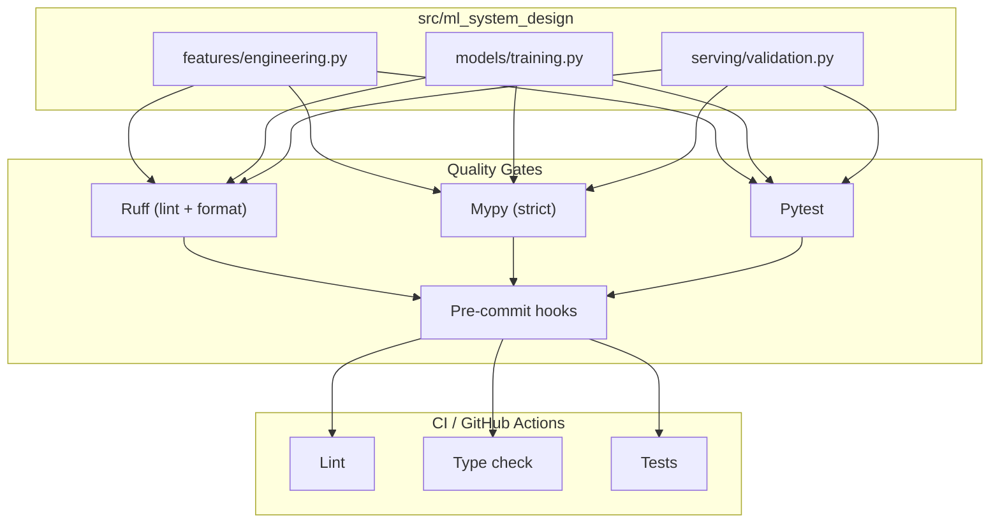

# ml-system-design-template

> **Status:** `Template` · **Domain:** ML Engineering / MLOps · **Last validated:** 2026-08

[](pyproject.toml)
[](pyproject.toml)
[](.pre-commit-config.yaml)
[](tests/)
[](.pre-commit-config.yaml)
[](LICENSE)

## 📌 Executive Summary

Plantilla de referencia para diseñar sistemas de ML con estándares de producción: código con
**type hints** y **docstrings estilo Google**, **tests con pytest**, linting/formatting con
**Ruff**, chequeo de tipos con **mypy (strict)** y **hooks de pre-commit**. Incluye módulos de
ejemplo (feature engineering, entrenamiento con validación, y utilidades de serving con detección
de drift PSI) para que cualquier proyecto nuevo arranque desde una base auditable y mantenible.

## 🎯 Business Impact & KPIs

| Business problem | KPI optimized | Baseline | Target | Observed |
|---|---|---|---|---|
| Código de ML difícil de mantener y auditar | Cobertura de tests | 0% | >80% | **pytest configurado + casos de ejemplo** |
| Errores de tipos que explotan en producción | Errores detectados en CI | Detección manual | Automática | **mypy strict + Ruff en CI/pre-commit** |
| Onboarding lento de nuevos científicos | Tiempo hasta el primer commit | Horas | Minutos | **Estructura src/ + tests lista** |

## 🧠 Methodology & Statistical Rigor

- **Feature engineering:** extracción de features cíclicas (día/semana/mes) y tiempo transcurrido,
  con transformador compatible con scikit-learn (`DateFeatureExtractor`).
- **Modelado:** pipeline de preprocesamiento + regresión con `cross_validate` (5-fold) y métricas
  holdout (`EvaluationReport`).
- **Serving / gobernanza:** **Population Stability Index (PSI)** para detectar drift de features y
  validación de esquema contra el contrato del modelo.

### Ecuaciones clave

PSI (drift entre ventana de referencia $E$ y ventana actual $A$, discretizadas en $k$ bins):

$$\text{PSI} = \sum_{i=1}^{k} (A_i - E_i) \cdot \ln\!\left(\frac{A_i}{E_i}\right)$$

## 🏗️ System Architecture



## 📊 Results

| Metric | Value | Detail |
|---|---|---|
| Módulos de ejemplo | 3 | features, models, serving |
| Tests | 8+ | `tests/test_engineering.py`, `tests/test_validation.py` |
| Calidad | Ruff + mypy strict + pytest | Configurados en `pyproject.toml` |
| Hooks | 7 hooks | `pre-commit-config.yaml` (trailing, yaml, debug, ruff, mypy...) |
| CI | Automático | `.github/workflows/ci.yml` en cada push/PR |

## 🛠️ Tech Stack

| Layer | Tools |
|---|---|
| Modelado | numpy, pandas, scikit-learn |
| Calidad | Ruff, mypy (strict), pytest, pre-commit |
| CI/CD | GitHub Actions |

## 📂 Project Structure

```
.
├── src/ml_system_design/
│   ├── features/engineering.py   # Transformadores scikit-learn (type hints + docstrings Google)
│   ├── models/training.py        # Pipeline, evaluación holdout y CV
│   └── serving/validation.py     # PSI (drift) y validación de esquema
├── tests/
│   ├── test_engineering.py
│   └── test_validation.py
├── pyproject.toml                # Config de Ruff, mypy, pytest, setuptools
├── .pre-commit-config.yaml       # Hooks de calidad locales
├── .github/workflows/ci.yml      # CI en GitHub Actions
└── README.md
```

## 🚀 Quick Start

```bash
git clone https://github.com/jordanvt18/ml-system-design-template
cd ml-system-design-template
python -m venv .venv && source .venv/bin/activate
pip install -e ".[dev]"

# 1. Instalar hooks de pre-commit
pre-commit install

# 2. Lint + formato
ruff check . && ruff format --check .

# 3. Tipos
mypy src

# 4. Tests
pytest -q
```

**Requisitos:** Python 3.10+. En CI todo se ejecuta automáticamente en cada push/PR.

## 📈 Monitoring & Governance

- **Calidad como barrera:** lint, tipos y tests bloquean merge en CI — un modelo nuevo solo entra a producción si pasa las 3 puertas.
- **Drift:** `serving/validation.py` expone PSI para monitorear features en producción (umbral recomendado: >0.25 = drift significativo).
- **Versionado:** datos con DVC (recomendado), modelos con MLflow, código con git tags semánticos.
- **Extensión:** agregar un módulo nuevo = paquete en `src/` + tests + docstrings Google (el pre-commit lo verifica).
